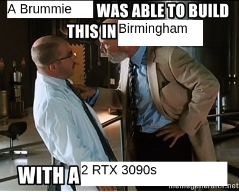

# (WIP) Training Flow Matching From Scratch On A Budget
#### Note: Work in Progress, this repo will be updating quickly in the days and weeks to come as I develop things. Currently, the code is a bit of a mess whilst I figure out what works and what doesn't, but I will be cleaning it up and organising it at the end.




## The Problem

Most flow matching and diffusion models require organisational scale computational resources to train. This is a problem for researchers and people like myself who want to keep up with the field, experiment and develop models, but don't have access to those resources.

Even papers which proclaim to be optimising for rapid training such as the REPA paper ([ArXiv](https://arxiv.org/abs/2410.06940)) still use 8 H100 GPUs for training, which they reportedly can run at 5.4 gradient updates/second. Given that their model requires 200k to 400k gradient updates to begin to produce something of reasonable quality, this equates to around 164 total GPU hours. At a cost of $2.76 per GPU hour on Lambda.ai Cloud, this comes to around $440 just for 1 single experiment run.

This is not at all reasonable for most researchers without significant organisational resources. Given you would almost certain need multiple training runs to debug and get things working, tune hyperparameters etc., the cost quickly balloons into the thousands to dollars.

This is assuming you can even get a hold of 8 H100 GPUs. Most of the time, they're too busy and unavailable on various cloud platforms.

## The Solution

In this repository, I demonstrate an alternate, suboptimal but still viable strategy.

Instead of using datacentre GPUs, we train on second hand consumer grade hardware. In particular, I use 2x RTX 3090 GPUs, which cost around 800 GBP (1000 USD) each at time of purchase. The full rig costs around 2000 GBP (2500 USD) including the rest of the components. The full neofetch output is included below

```
henry@mainstay ~ % neofetch
                   -`                    henry@mainstay 
                  .o+`                   -------------- 
                 `ooo/                   OS: Arch Linux x86_64 
                `+oooo:                  Host: MS-7D70 1.0 
               `+oooooo:                 Kernel: 6.19.11-arch1-1 
               -+oooooo+:                Uptime: 1 day, 13 hours, 24 mins 
             `/:-:++oooo+:               Packages: 623 (pacman) 
            `/++++/+++++++:              Shell: zsh 5.9 
           `/++++++++++++++:             Terminal: /dev/pts/2 
          `/+++ooooooooooooo/`           CPU: AMD Ryzen 7 9700X (16) @ 5.582GHz 
         ./ooosssso++osssssso+`          GPU: NVIDIA GeForce RTX 3090 
        .oossssso-````/ossssss+`         GPU: NVIDIA GeForce RTX 3090 
       -osssssso.      :ssssssso.        Memory: 23146MiB / 96149MiB 
      :osssssss/        osssso+++.
     /ossssssss/        +ssssooo/-                               
   `/ossssso+/:-        -:/+osssso+-                             
  `+sso+:-`                 `.-/+oso:
 `++:.                           `-/+/
 .`                                 `/
```

Whilst this is not pocket change by any means, it is a one time cost. It allows you to keep training and iterating without incurring any additional costs beyond power costs. The power usage of 2x RTX 3090s is just under 700W at max load, which we'll round up to 1kW to include the power of the CPU and rest of the system. British electricity prices are around 0.25 GBP per kWh, so this is around 0.125 GBP per GPU hour effectively, which is a fraction of the cost of cloud GPUs.

## Engineering Strategy

To fully utilise the limited resources and so it doesn't take 6 months to train a model, we pull every optimisation trick in the book.

1. We use small, efficient models whenever we can. For the pretrained VAE, we use NVidia's Deep Compression Autoencoder, which compresses 256x256 images into a 32 channel 8x8 latent space. In half precision, this is incredibly small and efficient to work with. The trade off is that the latent space is going to be "denser", and might be a little more difficult to optimise. But this is a fine trade off. In addition, we use Gemma3-270M as our pretrained LLM text encoder. Gemma3-270M is by all measures a very small but still very capable model. The latent space is also small, at only 640 dimensions. For the DiT model itself, we use NVidia's SANA architecture with the layers made a bit narrower.

2. We are realistic about image resolution. Whilst many state of the art models can push to 1024x1024 or even 2048x2048 resolution, we stick to 256x256. Our goal isn't to produce a state of the art model, but to produce a model we can reasonably work with and experiment on. 256x256 is still a perfectly good resolution for this. Another added bonus of this is that it makes our disk space requirements more manageable. The PD12M dataset is around 30TB in its original form. By using 256pixel resolution, we only need about 650GB of disk space for the whole dataset, which is multiple orders of magnitude smaller. This is especially useful as 30TB of disk space is not exactly cheap, especially if you're using SSDs instead of HDDs.

3. We use efficient training strategies. By the looks of it, the REPA paper ([ArXiv](https://arxiv.org/abs/2410.06940)) has a very efficient optimisation strategy. So we'll use that one. Sticking with point 1, to compute the REPA embeddings, we use DinoV2-small. This is a small model, but is still more than sufficiently capable for what we need.

4. We precalculate as much as possible. We precalculate all the VAE latents, the REPA embeddings, and the text embeddings. This means that during training, we can load them from the disk. It also actually simplifies our training code a lot, as we don't have to worry about all the other bits. Precalculating embeddings also has the advantage of lowering disk space costs. When we precalculate embeddings, we don't need to shuffle at all. This means that we can actually store our image dataset on a HDD and read sequentially, which is more than fast enough for this. We then store the precalculated embeddings on a smaller SSD which allows us to get away with spending much less on disks.

5. Precalculating all the embeddings still does require a lot of disk space, due to the length of the text embeddings. Even if we use a 128 token length, this equates to 128 * 640 = 81920 dimensions per prompt. As I previously said, disk space ain't that cheap these days, especially with SSDs. To get around this we compress whenever is possible. We keep all the embeddings in half precision. In addition, we compress all our torch tensors with XZ compression at max compression level. From experience, this can get anywhere between a 3-8x compression ratio. This allows us to fit the whole dataset of precalculated embeddings in around 700GB, which fits on a single consumer grade 1TB SSD.

6. We use mixed precision training of course, along with gradient accumulation. With 2x RTX 3090s, we can train with a batch size of around 64, equating to 128 with 2 GPUs. Using 8 gradient accumulation steps, this gets us a total effective batch size of 1024, which stabilises training. From experience, using gradient accumulation also allows each batch to be processed quicker. I suspect this is because there's no GPU synchronisation needed until the end of the gradient accumulation steps, which allows for more efficient GPU utilisation.

7. A critical often overlooked aspect is that you rarely get the first run right. You need multiple runs to debug things. So we make things as simple as possible to debug and iterate on. We do this by using as much out of the box tools as we can via PyTorch Lightning. This gets us all the benefits of mixed precision, DDP, gradient accumulation etc. without having to implement and debug any of it ourselves, which costs GPU time. We of course also use Weights and Biases for logging.

8. There is somewhat of an elephant in the room, being the dataset choice. There's a lot out there. LAION is an obvious choice, but it's also huge and very noisy. Older datasets like SBU Captions exist and are more manageable, but they're quite small and the quality isn't there. ImageNet is tried and true classic, but it doesn't have text captions. COCO is the absolute gold standard for image captioning, but even when you count every image-caption combination as a separate datapoint, it's still only around 650k datapoints. We want something which is large, but not so large it's unmanageable. We also want something with good quality so that training is easier. With a bit of digging, I settled for [PD12M](https://huggingface.co/datasets/Spawning/PD12M) for the main training run. It's around 12.4 million image-caption pairs, which is a good size for training a model. It's also of excellent quality as it's specifically selecting for high aesthetic quality images, and the captions are synthesised by a VLM. There are also some other smaller datasets I found on Huggingface which contain human captioned images, which I might use for finetuning after the main training run.

## Layout of the Repository

Most of the scripts should be self explanatory, but the main ones are:

- `precalculate_embeddings.py`: This script precalculates all the VAE latents, REPA embeddings and text embeddings. It then saves them to disk with xz compression

- `main.py`: This is the main training script. It loads the precalculated embeddings from disk, and trains our model using a yaml config for hyperparameters. Note that hyperparameters aren't saved with the model checkpoints, because we may want to twiddle and change them whilst we train, and if they're part of model checkpoints, then that becomes much harder

## Results

### Speed

With this pipeline, we can precalculate embeddings at a rate of around 200 images-text pair per second on both GPUs fully utilised. This allows us to precalculate the whole PD12M dataset in around 17 hours, which is pretty reasonable for a one time cost.

During training, we can achieve 3.34 batches/second, with a batchsize of 64 per GPU. Using 8 gradient accumulation steps (effective batch size of 1024), this gives around 0.42 gradient updates/second. This gives around 36k gradient updates per day, which is not incredible, but sufficient to train a model in a reasonable amount of time. It is much slower than the 5.4 gradient updates per second reported by the REPA paper, but that is to be expected. They have 8x H100s, and we're using 2x RTX3090s.

A H100 has a theoretical BFP16 throughput of almost 2000 TFLOPS, so 8 H100s can do 16,000 TFLOPS. The RTX3090 theoretical performance is a bit harder to find, but an [NVidia PDF](https://www.nvidia.com/content/dam/en-zz/Solutions/geforce/ampere/pdf/NVIDIA-ampere-GA102-GPU-Architecture-Whitepaper-V1.pdf) shows around 70 TFLOPS in BFP16, so 2 RTX 3090s can do around 140 TFLOPS. Given we are working with a factor of around 100x less compute power, the fact that we are able to achieve 10% of the training speed is actually pretty good. It's still suboptimal, but it's very much passable for developing a model in a reasonable amount of time for experimenting.

### Samples
Model is currently training still, results coming soon...

## Extras

There are some other implementations of seminal diffusion and flow matching papers in the `other_examples` folder. These include the original Flow Matching paper, the Nonequilibrium Thermodynamics paper, and the original Denoising Diffusion Probabilistic Models paper. These are all implemented in a simple way without much of the optimisations and engineering strategies above. I built them in the process of diving deeper into flow matching and diffusion models. They're still a bit of a mess, but I'll clean them up soon. They're not really meant to be used for training, but more for educational purposes and to play around with the code and understand the details of how these models work. They're all implemented in PyTorch Lightning as well for simplicity.